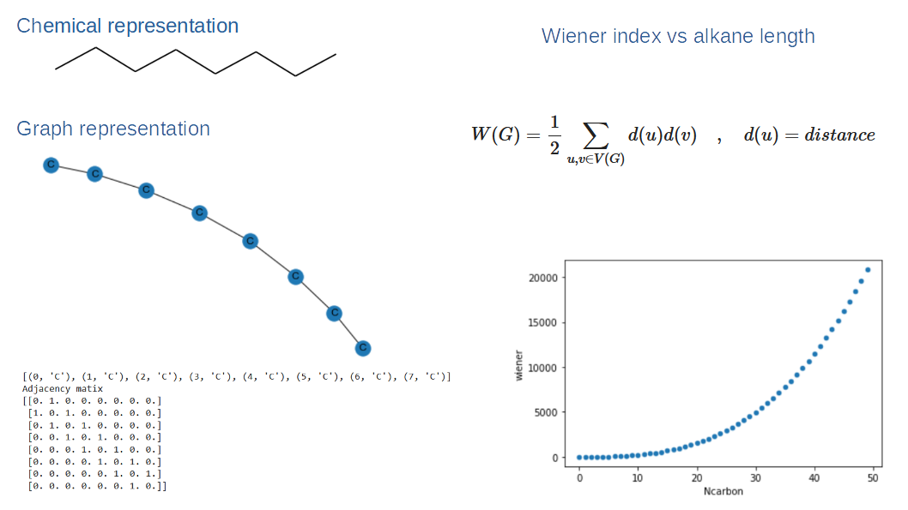

## Cheminformatics: Introduction to molecular graphs. 
How to represent molecules as graphs and how to extract unique mathematical identifier (graph invariant topological index)
based on the molecule connectivity, structure and chemical property. 
Python library used: RDkit and NetworkX. 

