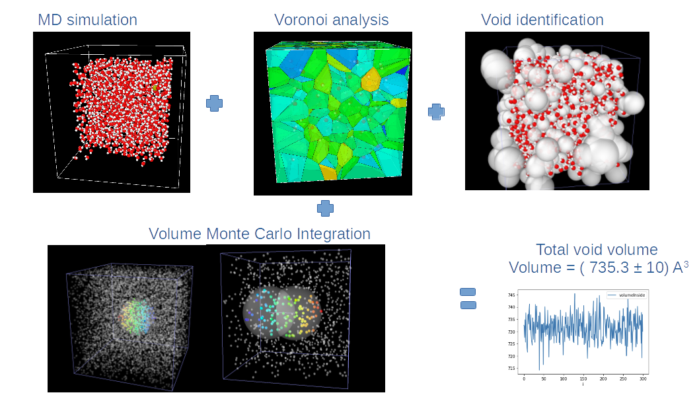

##Voronoi tessellation of water molecules:

### This data analysis of water molecule used Voronoi tessellation to geometrical space of individual atoms, which allowed for the determination of the maximum void spaces between the molecules. A Monte-Carlo integration was used to statistically compute the total void volume. Voronoi tessellation is a powerful tool for analyzing spatial structures across various fields. In physics and materials science, it models crystal structures, grain boundaries, and molecular environments. In biology, it describes cell packing, tissue growth, and species territories. In computer science, it underlies algorithms for clustering, nearest-neighbor search, and machine learning classification. Voronoi diagrams also model galaxy distribution in astronomy, facility location and urban planning in geography, and pore structure in chemistry. 
Its ability to partition space based on proximity makes it essential for understanding complex systems and optimizing resource distribution. 

