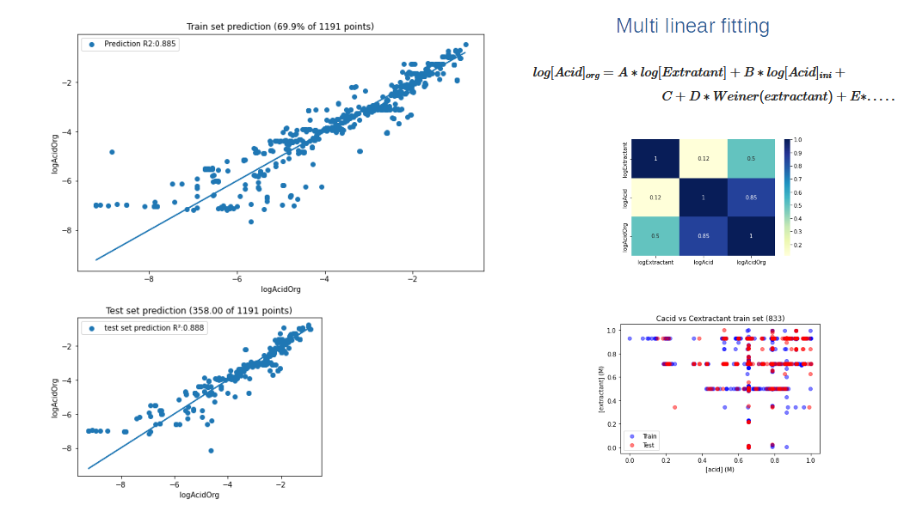

## Multi-linear fitting

Modeling of acid extraction using a multi variable function that depended on system conditions and some graph topological indices. 
Extractant molecules are converted to a molecular graph where the topological indices are calculated using cheminformatics packages. 
Data cleaning was needed to identify linear regimes, correlation matrices was used to distinguish independent variables,
k-fold trainning was used to identify best trainning configurations.

