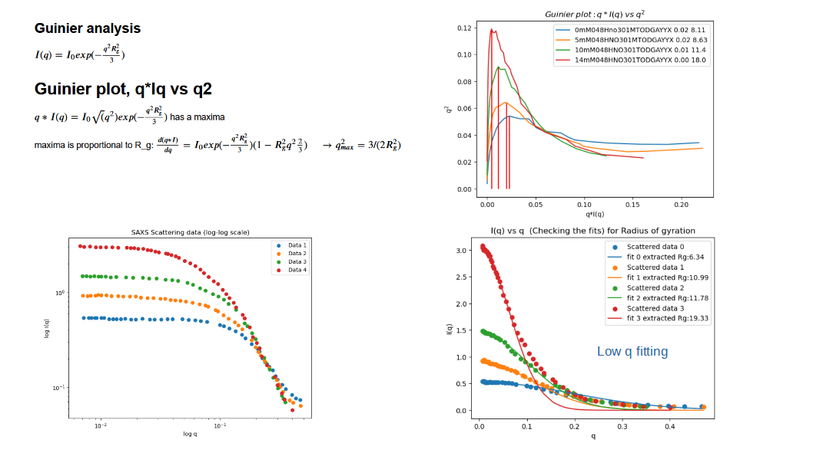

## Data analysis, fitting and plotting of X-ray scattering data: 

Fitting of exponential and inverse functions to extract physical properties (radius of gyration, correlation length) with theoretical modeling.
Guinier's plot is used to identify maxima. 

