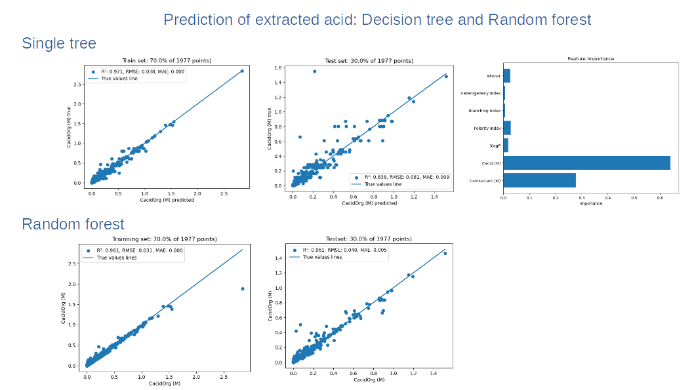

## Predictive Decision tree and random forest

Machine learning Decision tree: Modeling of acid extraction using decision tree and random forest.
Tree depth was adjusted to give proper fitting of the data. Key entropic contribution of features were identified to extract the most important
features of the data. 

